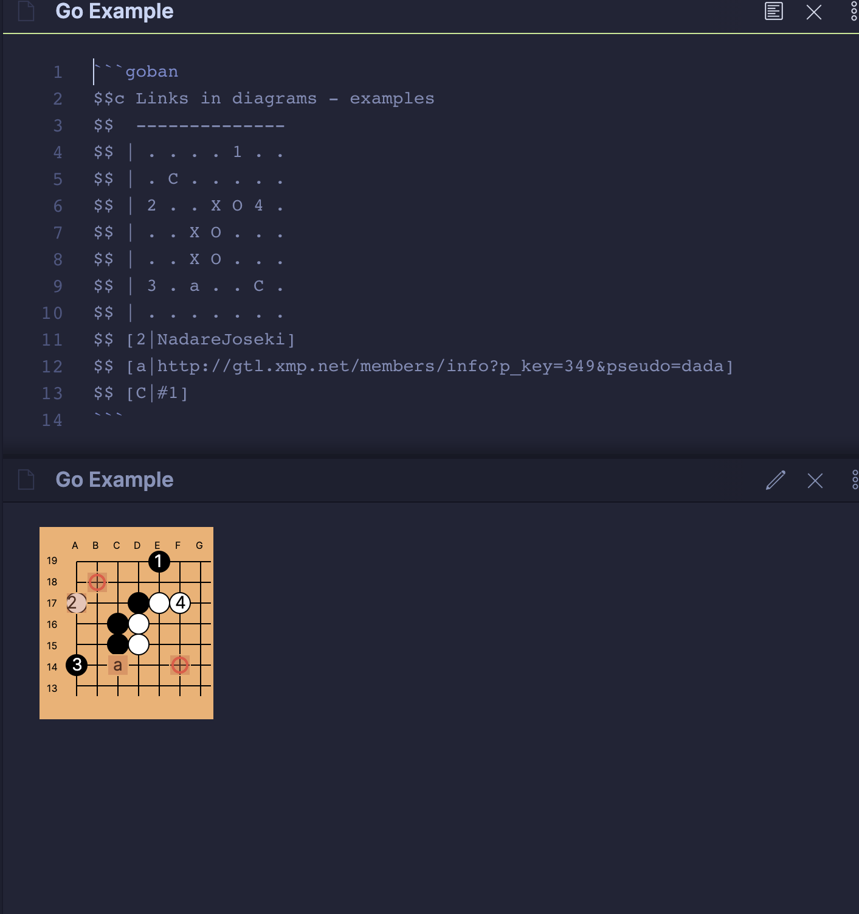

# Obsidian Goban Plugin

This plugin adds the capability to visualize Go/Baduk diagrams written in the [Sensei's Library](https://senseis.xmp.net/?HowDiagramsWork) format.

This is still a very WIP plugin.

## How to use it

After you installed the plugin, just write the diagram position representation inside a code block with the `goban` language.

### Example

